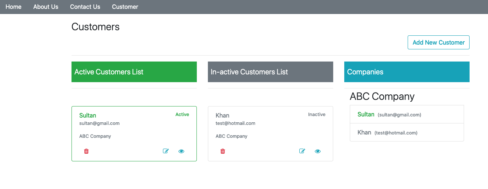
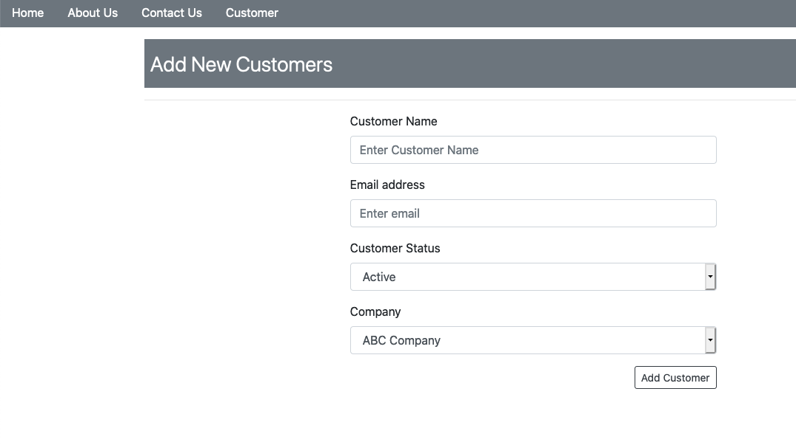
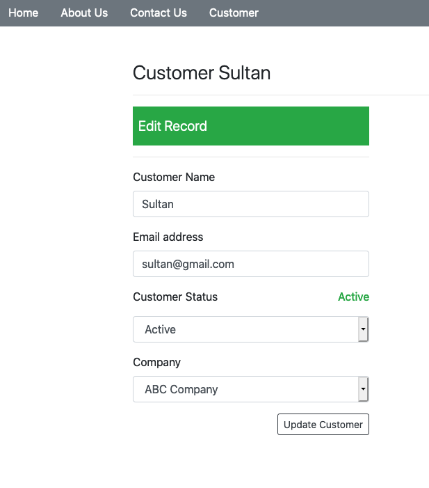
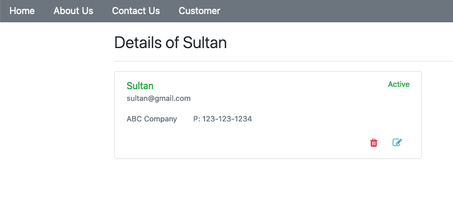

# Beginners Laravel Learning Project 
This project is for laravel bignners.
### Learning Laravel
A simple CRUD application using laravel 6.x For those who wnat to learn Laravel.

### Creating Controllers and Models 

Create Controllers and Models using Laravel's **commandline** utility **artisan** which shipped with Laravel and installed with laravel installation.


### Create Controller using php artisan
 Controllers can be created using **php artisan** as follows
 ```shell
 $ php artisan make:controller CustomersController
 ```
### Create Model using php artisan
 ```shell
 $ php artisan make:model Customers
 ```
 If used with **-m** flag it will create migration also
 ```shell
 $ php artisan make:model Customers -m
 ```
### Create Migrations using php artisan
 ```shell
 $ php artisan make:migration Customers
 ```

 Both can be done in one go with migration as well.
 ```shell
 $ php artisan make:model Customers -mc
 ```

 It will create file inside **databse/migration** with name like this 
 > *2019_10_16_142245_create_customers_table.php*

with some biolerplate code like this
```php
<?php

use Illuminate\Database\Migrations\Migration;
use Illuminate\Database\Schema\Blueprint;
use Illuminate\Support\Facades\Schema;

class CreateCustomersTable extends Migration
{
    /**
     * Run the migrations.
     *
     * @return void
     */
    public function up()
    {
        Schema::create('customers', function (Blueprint $table) {
            $table->bigIncrements('id');
            $table->timestamps();
        });
    }

    /**
     * Reverse the migrations.
     *
     * @return void
     */
    public function down()
    {
        Schema::dropIfExists('customers');
    }
}

```


 ### Adding Route in web.php

 To add new **Route**  open file inside **resources/web.php** and add code as given below.
 ```php
 Route::get('customers', 'CustomersController@index');
 ```
 considering we created a controller for customers and its called **CustomersController**
 
 
Controllers are added in floowing path **app/Http**
we add index method as follows
```php
public function index()
    {
        $activecustomers = Customer::active()->get();
        $inactivecustomers = Customer::inactive()->get();
        return view('customers.customers',compact('activecustomers','inactivecustomers'));
    }
```
The above function is getting active and inactive customers.
We use Laravel scoping facility to create **active()** and **inactive()** methods which we creat in **Customer Model**

Little on Scoping and how to create scpoe metnod bellow is an example.
```php
public function scopeActive($query)
    {
        return $query->where('active', 1);
    }
    public function scopeInactive($query)
    {
        return $query->where('active', 0);
    }
```
Above are two scope methods we use in our **Customer Model**.

### More here [Later]

----

### Creating Company Model
Run following command 
```php 
$ php artisan make:model Company -m
```
It will create Model and migration in one go.

Open migration file **2019_10_17_100119_create_companies_table.php**
Look at the **up** function. It will be like this 
```php
 public function up()
    {
        Schema::create('companies', function (Blueprint $table) {
            $table->bigIncrements('id');
            $table->timestamps();
        });
    }
```
Now we will add two more fields as **name** and **phone**
```php

$table->string('name');
$table->string('phone');
```
Whole function would be like this
```php
public function up()
    {
        Schema::create('companies', function (Blueprint $table) {
            $table->bigIncrements('id');
			$table->string('name');
			$table->string('phone');
            $table->timestamps();
        });
    }
```

**[Remeber Don't forget $fillable=[] fields ]**

Open Model file **Company.php** inside **app** directory
and add **$fillable**
```php
class Company extends Model
{
    protected $fillable = ['name', 'phone'];
}
```

[Remember you create migration but this migration does not create table in database. It only created schema for the database.]

### Creating table in database
To create table in databas Run following command.
```shell
$ php artisan migrate
```
It will check migrations and if found any changes it will run migration.
Definately there is change and there is new migration for Company so it will create **companies** table in database and will leave all previous migrations as is.

### Laravel tinker

Tinker is python shell from where app can execute specially Database operation.

To run **tinker** use following command
```shell
$ php artisan tinker

Psy Shell v0.9.9 (PHP 7.3.10 — cli) by Justin Hileman
>>>
```

It will bring in python shell **>>>** like this. To exit tinker type **exit**

 To run **Company model** write folowing in python shell
 ```python
 >>> $c= new App\Compnay();
 => App\Company {#3003}
 ```
 Create Company using tinker
 ```python
 >>> $cr= Company::create(['name'=>'ABC Company', 'phone'=>'123-123-1234'])
 ```
 Result:
 ```python 
 [!] Aliasing 'Company' to 'App\Company' for this Tinker session.
=> App\Company {#3011
     name: "ABC Company",
     phone: "123-123-1234",
     updated_at: "2019-10-17 10:39:55",
     created_at: "2019-10-17 10:39:55",
     id: 1,
   }
>>> 
 ```

 ### Creating Auth in Laravel 6
 Laravel 6 has removed make:auth command and authentication scaffolding has been moved as a separate package named laravel/ui

The command to implement Auth is as follows:

```shell
$ composer require laravel/ui
$ php artisan ui vue --auth
```
### The ui:auth Command

Besides the new ui command, the laravel/ui package comes with another command for generating the auth scaffolding:

```shell
$ php artisan ui:auth
```
If you run the **ui:auth** command, it will generate the auth routes, a **HomeController, auth views**, and a **app.blade.php** layout file.


### Some images








Still lot more left to do in laravel Learning process.
We work normally dont rush.


Create mail using php artisan
```shell
$ php artisan make:mail ContactFormMail --markdown=emails.contact.contact-form
```


### Laravel event Listeners :

Two ways to create events & listeners
---

#### creating evevnt

**Exapmle: Create New customer creation events**

Suppose we have three events:
 > 1-   Send email<br>
 > 2-   Register to news Letter<br>
 > 3-   Slack notification to Admin

1 - **CustomerController@store();**
```php
<?php
public function store(Customer $customer){
    // customer data validation 

    // generate event listener
    event(new NewCustomerHasRegisteredEvent());

    // new customer email
     Mail::to($event->customer->email)->send(new WelcomeNewUserMail());

    // Register to news Letter
    dump('Register to news Letter');

    //Slack notification to Admin
    dump('Slack notification to Admin');

     //return redirect('customers');

}
```

We have one event and three listeners and we sending email and dumping other events.


### Manual Process:

run **php artisan make:event** &  **php artisan make:listener** commands. 

Make the event **NewCustomerHasRegisteredEvent** by running following command
```shell
$ php artisan make:event NewCustomerHasRegisteredEvent
```

Inside **app/Events** looke for file ***NewCustomerHasRegisteredEvent.php***

In construstor function data can be accepted. so pass data from event


```php

// CustomerControll.php [store()]
event(new NewCustomerHasRegisteredEvent(£customer));

 //NewCustomerHasRegisteredEvent.php
public function __construct($customer)
    {
        $this->customer = $customer;
    }
```

>1- make **customer(variable) ** or ** whatever data variable**   public  
>2  ***public*** allow to access data in **listener**

Event is ready.

Now ite time to make **listener**
Run following command and create listener **WelcomeNewCustomerListener**

```shell
$ php artisan make:listener WelcomeNewCustomerListener
```

There will be an new directory inside app **app/Listeners**

Remove mail process from store() method of CustomerController and add it into Listener's **handle()** method.

```php

public function handle($event)
    {
         Mail::to($event->customer->email)->send(new WelcomeNewUserMail());
    }
```
>1- ***$event->customer*** showing that we accessing customer data from event.  
>2- **import** required classes.

Now we need to hook this all to perform actions

To **hook** event with listener Laravel provide **EventServiceProvider.php** file inside **providers** directory inside **app** directory.  
Path to providers is **app/providers**

Add Event **evenServideProvider.php** file
```php
protected $listen = [
        /*
        Registered::class => [
            SendEmailVerificationNotification::class,
        ],
        */
        NewCustomerHasRegisteredEvent::class =>[
            WelcomeNewCustomerListener::class,
        ],
    ];
```

That is it for the manual process.

There is another way to create Listeners

First create event and then use php srtisan to create listeners. 
Open **EventServiceProviders.php** file and add following events acordint to our example

```php
protected $listen = [
        /*
        Registered::class => [
            SendEmailVerificationNotification::class,
        ],
        */
        NewCustomerHasRegisteredEvent::class =>[
            \App\Listeners\WelcomeNewCustomerListener::class,
            \App\Listeners\RegisterCustomerToNewsletter::class,
            \App\Listeners\NotifyAdminViaSlack::class,
        ],
    ];
```

Here we asume that we already had event defined.
After that we add class names related to listeners. 
>   **WelcomeNewCustomerListener**   
>   **RegisterCustomerToNewsletter**   
>   **NotifyAdminViaSlack**

You can see we use absloute path  **/App/Listeners/** 
as we dont have classes defined and we want listenere to be in **app/listeners** directory.

Now run following **php artisan command.

```shell
$ php artisan event:generate
 ```

After running above command you will see listeners are generated for the even.

**That's It.**

So, if you want to change steps or remove listener just remove it from
**EventServiceProvider.php** and you done. :( 

>**[NOTE]: Events are always running and can cause blocking if you use such as sleep(1000) inside listener, so be carefull.**

---
